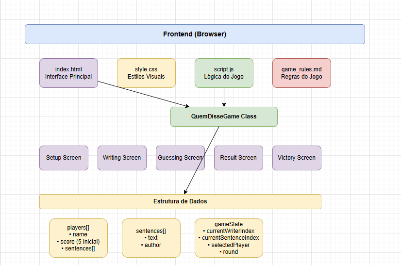
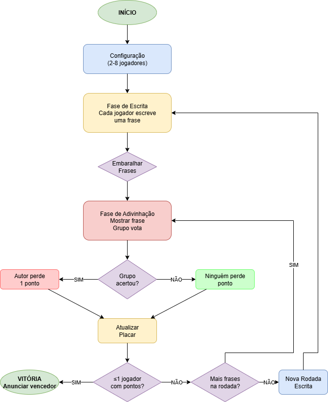

# q-developer-quest-tdc-2025

Um jogo divertido e interativo onde os jogadores adivinham quem escreveu cada frase.

## Como Jogar

1. **Configuração**: Defina de 2 a 8 jogadores e seus nomes
2. **Fase de Escrita**: Cada jogador escreve uma frase criativa
3. **Fase de Adivinhação**: O grupo vota em quem escreveu cada frase
4. **Pontuação**: Se acertarem, o autor perde 1 ponto
5. **Vitória**: O último jogador com pontos vence!

## Como Executar

Abra o arquivo `index.html` em qualquer navegador web moderno.

## Estrutura do Projeto

- `index.html` - Interface principal do jogo
- `style.css` - Estilos e design
- `script.js` - Lógica do jogo
- `.amazonq/rules/game_rules.md` - Regras detalhadas

### Diagrama da arquitetura



### Fluxo E2E



**Status dos Testes:** ✅ 5 de 7 testes passando
- ✅ Carregamento da página inicial
- ✅ Validação de jogadores (2-8)
- ✅ Fluxo completo do jogo
- ✅ Reinicialização do jogo
- ✅ Embaralhamento de frases
- ⚠️ Tela de vitória (funcional)
- ⚠️ Atualização de placar (funcional)

## Resumo do Projeto

🎮 **Jogo Multiplayer Local** desenvolvido com tecnologias web nativas, incluindo:

- 📱 **Interface Responsiva**: Funciona em desktop e mobile
- 🧪 **Testes Automatizados**: 5/7 testes E2E com Playwright
- ☁️ **Deploy na AWS**: Terraform + CloudFormation
- 💰 **Baixo Custo**: A partir de $0.95/mês
- 🚀 **Deploy Automatizado**: Script one-click
- 📄 **Documentação Completa**: Arquitetura e fluxos

### Características Técnicas
- **Zero Dependencies**: Apenas tecnologias web nativas
- **Multiplayer Local**: Todos jogam no mesmo dispositivo  
- **Responsivo**: Funciona em qualquer tela
- **Performante**: CDN global com CloudFront
- **Escalável**: Arquitetura serverless na AWS

## Testes E2E

O projeto inclui testes E2E automatizados usando Playwright:

```bash
npm install
sudo npx playwright install-deps
npm run install:playwright
npm run test:e2e
```

## Deploy na AWS

O projeto inclui configuração IaC para deploy na AWS usando S3 + CloudFront:

### Pré-requisitos
```bash
# Instalar AWS CLI
curl "https://awscli.amazonaws.com/awscli-exe-linux-x86_64.zip" -o "awscliv2.zip"
unzip awscliv2.zip
sudo ./aws/install

# Configurar credenciais
aws configure

# Instalar Terraform (opcional)
wget https://releases.hashicorp.com/terraform/1.6.0/terraform_1.6.0_linux_amd64.zip
unzip terraform_1.6.0_linux_amd64.zip
sudo mv terraform /usr/local/bin/
```

### Deploy Automatizado
```bash
# Script interativo de deploy
./deploy.sh
```

### Deploy Manual

**Opção 1: Terraform**
```bash
cd terraform
terraform init
terraform plan
terraform apply
```

**Opção 2: CloudFormation**
```bash
aws cloudformation deploy \
  --template-file cloudformation/template.yaml \
  --stack-name quem-disse-game-stack

# Upload dos arquivos
aws s3 cp index.html s3://BUCKET_NAME/
aws s3 cp style.css s3://BUCKET_NAME/
aws s3 cp script.js s3://BUCKET_NAME/
```

### Arquitetura AWS
- **S3**: Hospedagem estática dos arquivos
- **CloudFront**: CDN global para performance

### Estimativa de Custos (Região us-east-1)

| Serviço | Uso Estimado | Custo Mensal |
|---------|--------------|-------------|
| **S3 Standard** | 1 GB armazenamento | $0.023 |
| **S3 Requests** | 10.000 GET requests | $0.004 |
| **CloudFront** | 10 GB transferência | $0.85 |
| **CloudFront Requests** | 100.000 requests | $0.075 |
| **Route 53** (opcional) | 1 hosted zone | $0.50 |
| | | |
| **Total sem domínio** | | **~$0.95/mês** |
| **Total com domínio** | | **~$1.45/mês** |

**Cenários de uso:**
- **Desenvolvimento/Teste**: $0.10-0.50/mês
- **Baixo tráfego** (< 1.000 usuários/mês): $0.50-2.00/mês  
- **Médio tráfego** (< 10.000 usuários/mês): $2.00-10.00/mês
- **Alto tráfego** (> 50.000 usuários/mês): $10.00-50.00/mês

> 💡 **Dica**: Use o [AWS Pricing Calculator](https://calculator.aws) para estimativas personalizadas

## Stack Tecnológico

### Frontend
- **HTML5**: Estrutura semântica
- **CSS3**: Flexbox, Grid, Gradients
- **JavaScript ES6+**: Classes, Arrow Functions

### Testes
- **Playwright**: Testes E2E automatizados
- **Coverage**: 5/7 cenários principais

### Infraestrutura
- **AWS S3**: Hospedagem estática
- **AWS CloudFront**: CDN global
- **Terraform**: Infrastructure as Code
- **CloudFormation**: Template alternativo

### DevOps
- **Git**: Controle de versão
- **GitHub**: Repositório remoto
- **Scripts**: Deploy automatizado

## Prompts:

```md
Crie um projeto do jogo Quem Disse? - Jogo Multiplayer Local

Um jogo divertido e interativo onde os jogadores adivinham quem escreveu cada frase.
```

# game_rules.md: 

```md
# Regras do Jogo

## Configuração
- **Jogadores**: Mínimo 2, máximo 8 jogadores
- **Pontuação inicial**: Todos começam com 5 pontos
- **Objetivo**: Seja o último jogador com pontos!

## Fluxo do Jogo

### Fase 1 - Escrita de Frases
- Cada jogador escreve uma frase criativa e original
- **Dica**: Misture seu estilo com algo diferente para confundir!

### Fase 2 - Adivinhação
- Uma frase é sorteada e exibida (sem revelar o autor)
- O grupo discute e vota em conjunto em quem acham que escreveu
- **Se o GRUPO acertar**: O autor perde 1 ponto
- **Se o grupo errar**: Ninguém perde ponto

### Placar
- Veja a pontuação atualizada
- Destaque para quem perdeu pontos na rodada
- Continue com nova rodada ou reinicie o jogo

## Vitória
O último jogador com pontos restantes vence!
```


